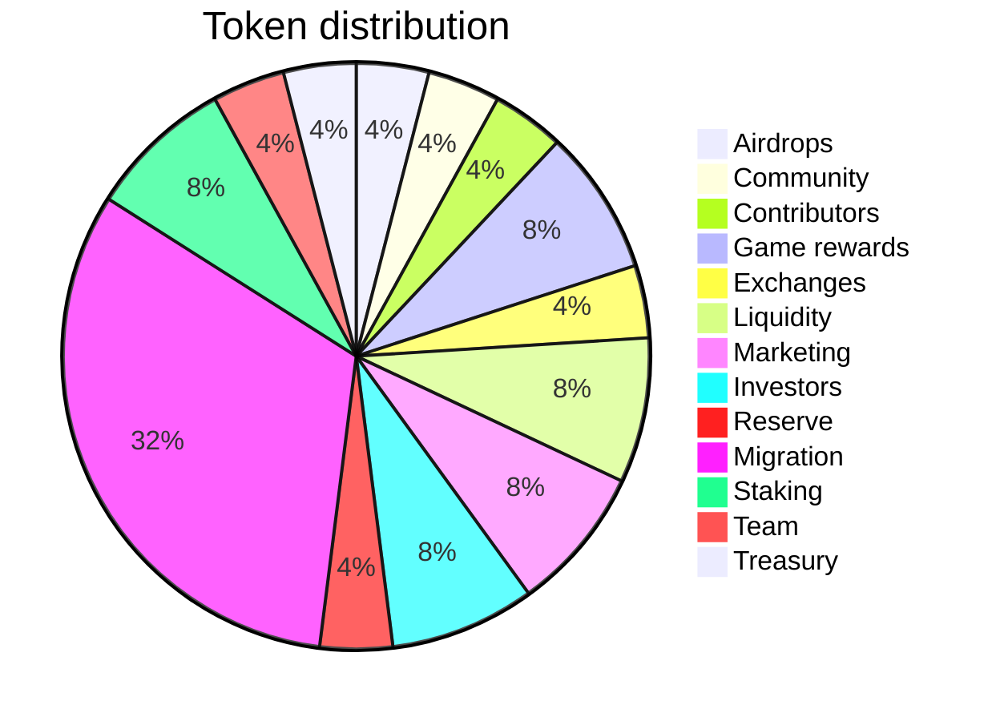

# Token economics

## Solana blockchain

### Token Details

| Category | Price      |
|:--------------:|:-----------:|
| Type | SPL token |
| Symbol | TBC |
| Total supply | 500 000 000 TBC (fixed) |
| Token contract | TBC |
| Initial circulating supply | TBC |
| Initial supply | TBC% |
| Seed sale price | TBC |
| Private sale price | TBC |
| Public sale price | TBC |

### Token distribution

### Vesting Schedule

| Category | Vesting | Amount |
|:--------:|:-------:|:------:|
| Airdrops | Linearly released in 24 months from Q3 2023 | 20 000 000 |
| Community | 1% monthly unlock starting from 2024 | 20 000 000 |
| Contributors | 0.5% monthly unlock starting from 2024 | 20 000 000 |
| Game rewards | 0.5% monthly unlock starting from 2024 | 40 000 000 |
| Exchanges reserve | 10% monthly unlock starting from 2024 | 20 000 000 |
| Liquidity | Exchanges and DEX | 40 000 000 |
| Marketing | 1% monthly unlock from 2024 | 40 000 000 |
| Private investors | Unlock Q2 2023 | 40 000 000 |
| Reserve | 1% monthly unlock from Q1 2024 | 20 000 000 |
| SLC token migration | Conversion 1:1 till Q1 2024; unclaimed goes to Team reserve | 160 000 000 |
| Staking reserve | Linearly released in 24 months from 2024 | 40 000 000 |
| Team reserve | 0.5% unlock each month from Q2 2023 for game development purposes | 20 000 000 |
| Treasury | Linearly released in 24 months from 2024 | 20 000 000 |

